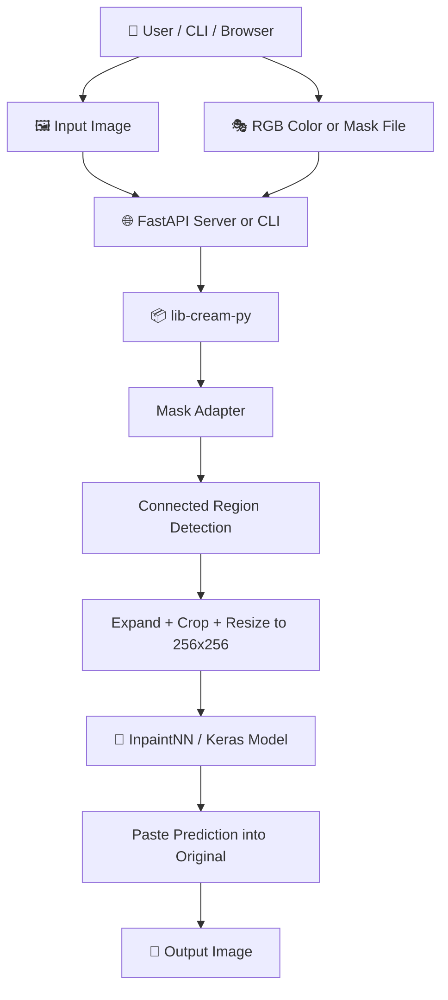
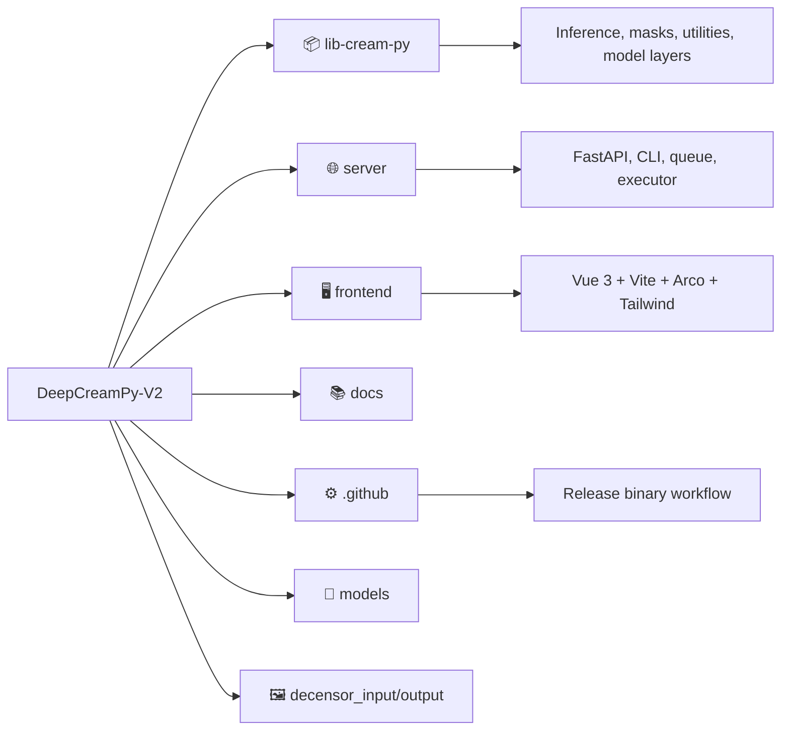
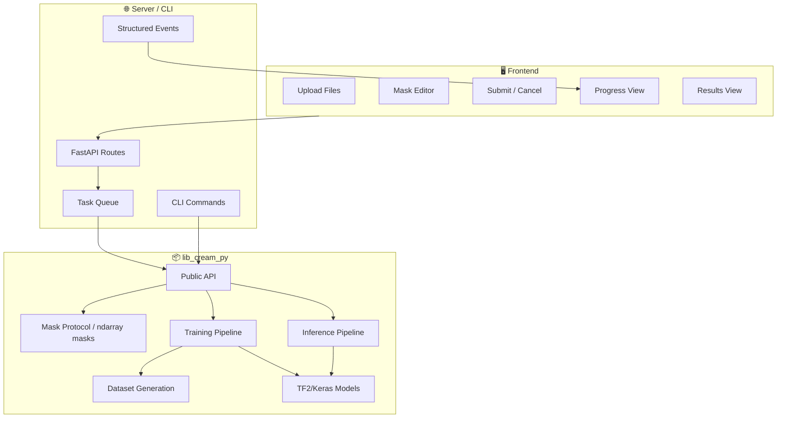
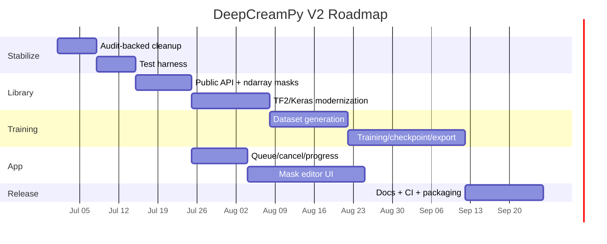
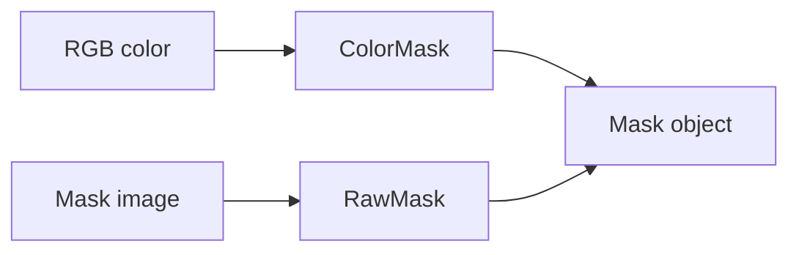
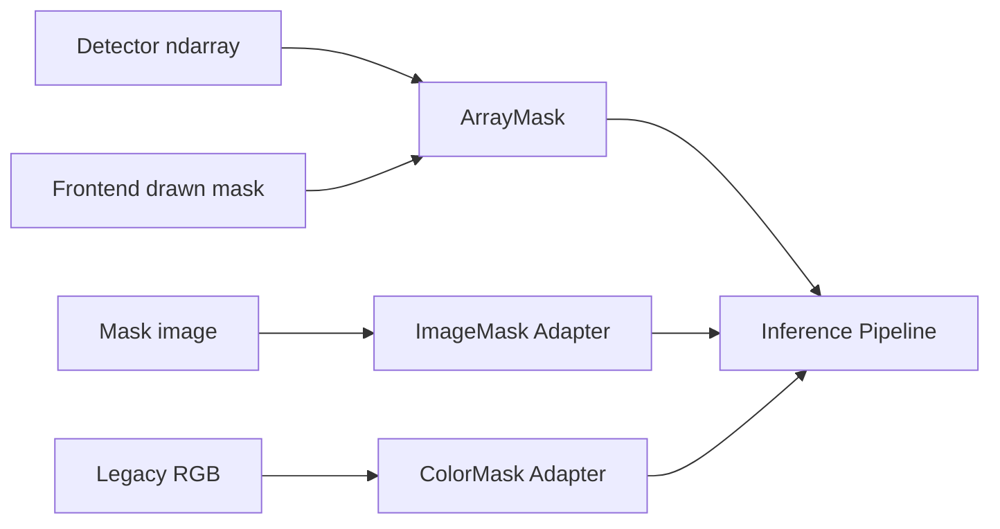
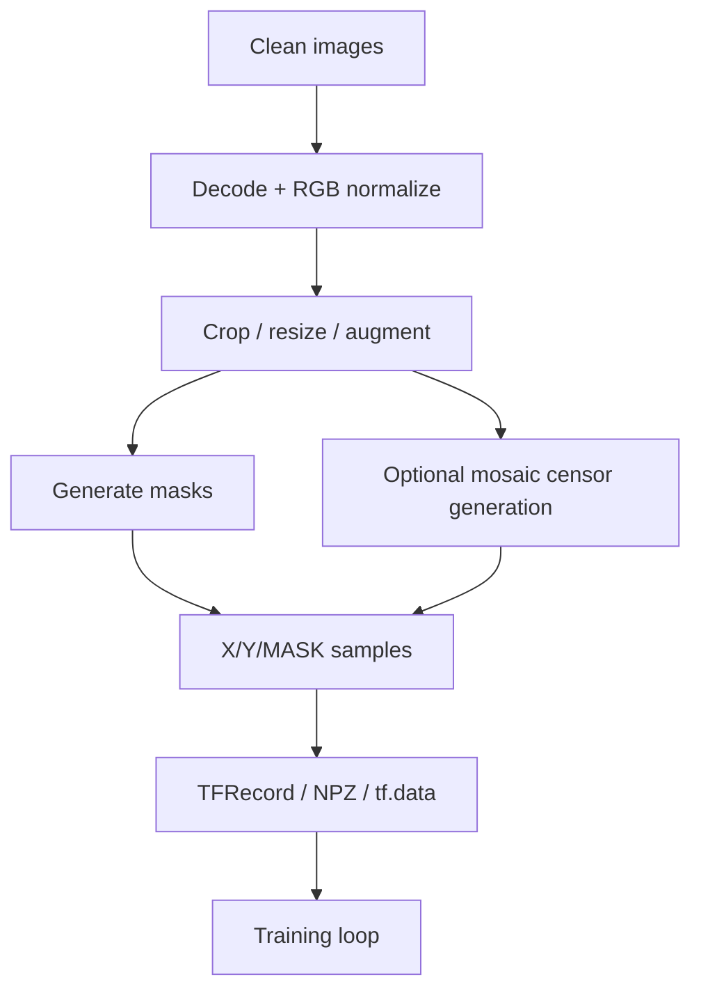
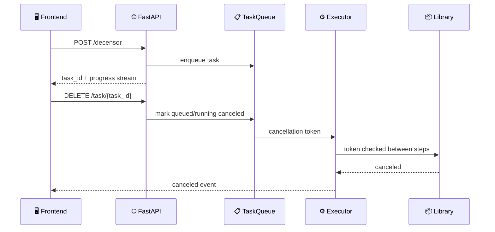
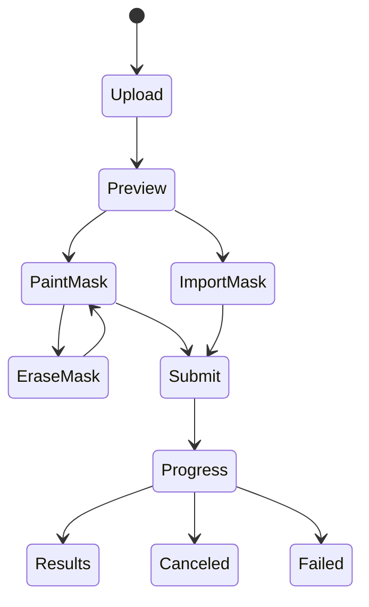
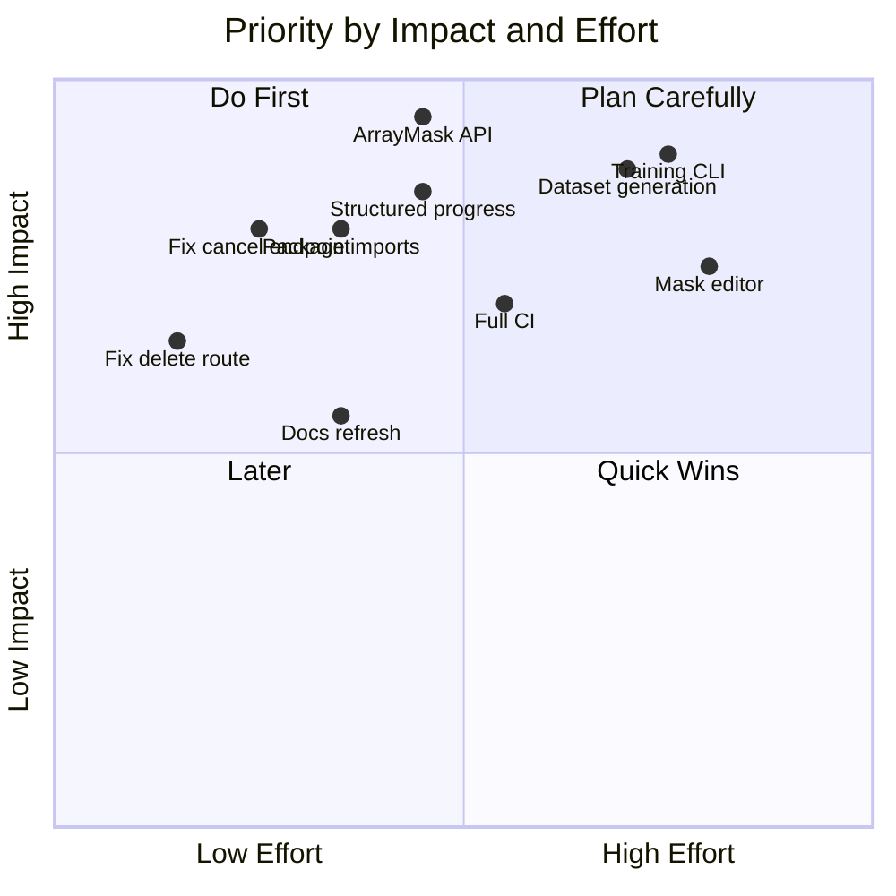

# DeepCreamPy V2 Roadmap 🧭

This roadmap is based on a full repository audit performed on 2026-06-30. It covers the current Python library, FastAPI server, Vue frontend, docs, release workflow, Dockerfile, and project configuration.

## Audit Summary 🔎

### What This Project Does Today

DeepCreamPy V2 is an image inpainting application for reconstructing censored regions in anime-style images.

The current flow is:

1. A user supplies an image.
2. A mask is found either from a selected RGB color or from a mask image file.
3. The library finds connected masked regions.
4. Each region is expanded, cropped, resized to 256x256, and passed through a TensorFlow/Keras inpainting model.
5. The generated pixels are pasted back into the original image.
6. The CLI/server/frontend save or stream progress/results.



### Current Repository Shape



### Audited Surfaces ✅

| Area | Files Audited | Current State |
|---|---:|---|
| Core library | `lib-cream-py/src/*.py`, `lib-cream-py/src/model/*.py` | Inference exists, training is experimental, package exports incomplete |
| Server/API | `server/*.py`, `server/serverr/*.py` | FastAPI queue works conceptually, cancel/progress have bugs |
| Frontend | `frontend/src/**/*.vue`, `main.ts`, configs | Upload/status UI exists, mask editor/progress/cancel incomplete |
| Docs | `README.md`, `docs/*.md` | Mostly legacy or partial; UI/training docs incomplete |
| Build/release | `Dockerfile`, `.github/workflows/release.yml` | Outdated paths and missing spec/requirements references |
| Tests | Repo-wide search | No real test suite present |
| Models | `models/.gitignore` | Model files intentionally absent |

## Current Architecture Findings 🧩

### Library Layer

Key audited symbols:

| File | Symbols |
|---|---|
| `lib_cream_py.py` | `test`, `decensor_image_variations`, `save_alpha`, `decensor_image`, `train` |
| `mask.py` | `Mask`, `find_mask`, `ColorMask`, `convert_matrix`, `RawMask2`, `RawMask` |
| `util.py` | `is_on_mask`, `find_regions`, `image_to_array`, `expand_bounding`, `apply_variant` |
| `logger.py` | `Logger` |
| `model/model.py` | `InpaintModel`, `InpaintNN`, `train_step` nested in `InpaintNN.train` |
| `model/encoder.py` | `reflect_pad`, `Encoder` |
| `model/decoder.py` | `ConvNN`, `Decoder` |
| `model/contextual_block.py` | `ceil`, `calc_c`, `softmax`, `ContextualBlock` |
| `model/disciminator_red.py` | `SNConv2D`, `DiscriminatorRed`, `DenseRedSN`, `spectral_norm`, `l2_norm` |

Important findings:

- `lib-cream-py/src/__init__.py` is empty, so the public package API is not clearly exported.
- Imports use top-level module names like `from logger import Logger`, which is fragile when installed as a package.
- `mask.find_mask` is a stub and returns an undefined variable.
- `ColorMask` uses exact color equality, so anti-aliased masks fail.
- `RawMask` still inherits from `ColorMask`, so ndarray masks are possible only through color-like threshold/image adapters, not as a first-class API.
- `decensor_image` accepts a `Mask` object, but still requires a `colored` image argument for region finding even though it only uses the mask array.
- `decensor_image` uses nested Python loops for pasting predictions, which will be slow on large images.
- `train` in `lib_cream_py.py` is hardcoded to `x.npy`, `y.npy`, `mask.npy`, and `./temp`.
- `InpaintNN.train` has an `IT = 0` placeholder, optimizer state questions, and limited checkpoint/restart semantics.
- Keras imports use private paths like `keras.src`, which is risky for modern Keras compatibility.
- Custom Keras layers need serialization registration and load/save tests.

### Server Layer

Key audited symbols:

| File | Symbols |
|---|---|
| `server/main.py` | CLI/UI entrypoint |
| `server/config.py` | `get_args` |
| `server/local.py` | `CliLogger`, `MaskInfo`, `generate_out_path`, `process`, `MyImage`, `get_imgs`, `join_mask` |
| `server/server.py` | `app`, `read_index`, `upload_files`, `delete_file`, `DecensorRequest`, `stream`, `notify`, `while_streaming`, `decensor`, `tasks`, `cancel_task` |
| `server/serverr/task.py` | `DecensorItem` |
| `server/serverr/myqueue.py` | `QueueElement`, `TaskQueue`, `task_queue`, `wait_in_queue` |
| `server/serverr/instance.py` | `MaskInfo`, `generate_out_path`, `WebLogger`, `get_img`, `get_file_path`, `ExecutorInstance`, `Executors` |

Important findings:

- `MaskInfo` and `generate_out_path` are duplicated between CLI and server executor.
- `/image/{image_id}` exists, but the frontend calls `/image`.
- `cancel_task` uses `next(...)` without a default, then checks for `None`, so missing tasks can raise before the intended error path.
- `cancel_task` calls `task_queue.remove(task)` without `await`.
- Running tasks only check `self.stop` between images, not between variants/regions/model calls.
- `sent_stream(..., sender=None)` can call `sender(...)` unguarded in several places.
- Progress messages serialize integers using `bytes(index)`, which creates N zero bytes instead of a readable or stable integer encoding.
- The binary stream protocol is undocumented and frontend parsing is hardcoded.
- `server/server.py` deletes `temp` at import/startup, which is simple but dangerous if reused as a library/server component.
- `DATA_DIR = Path("temp")` is relative to process cwd, not the server module path.
- Release workflow references `server/main.spec`, but that file is not present in the repo.

### Frontend Layer

Key audited symbols:

| File | Symbols |
|---|---|
| `App.vue` | `deleteImageServer`, `removeFile`, `getFilesJoinedM`, `handleFiles`, `get_mask_color`, `submitDisabled`, `getFilesJoined` |
| `UploadPage.vue` | `setState`, `process`, `processChunk`, `hexToRgb`, `uploadWithProgress` |
| `DropOver.vue` | `handleDrop`, `openFileInput`, `handleFileSelect` |
| `ViewFiles.vue` | `viewFile`, `removeFile` |
| `SubmitButton.vue` | `buttonClasses`, `click` |
| `Button.vue` | `buttonClasses`, `toggleActive` |
| `main.ts` | Vue app bootstrap |

Important findings:

- The frontend has an upload flow but no real image editor yet.
- `CENTER IMAGE EDITOR` is a placeholder.
- `Detect` mode is disabled.
- The progress screen displays only `{{ status }}`.
- Queue position is tracked but not meaningfully rendered.
- There is no cancel button.
- The mask-file request sends `"file-" + v.mask`, where `v.mask` is an object, not the uploaded mask id.
- `variations` frontend allows `3`, while server CLI restricts choices to `1, 2, 4`.
- Hardcoded API base URL is `http://127.0.0.1:8000`.
- No frontend tests exist even though TypeScript/Vitest-like config placeholders are present.

## Strategic Goals 🎯

The project should move toward these target qualities:

1. 📦 **Modular library**: core inference/training code usable without server or frontend.
2. 🧠 **Modern Python + TensorFlow 2/Keras**: supported, tested, serializable, and reproducible.
3. 🎭 **Mask not based on color anymore**: ndarray masks become the primary API; RGB/file masks become optional adapters.
4. 🏋️ **Trainable from repo**: dataset generation, preprocessing, mosaic generation, training, checkpointing, and export are documented and testable.
5. 🧪 **Confidence through tests**: unit, integration, smoke, and UI tests catch regressions.
6. 🖥️ **Usable frontend**: mask creation/editing, progress, cancel, and result visibility.

## Target Architecture 🏗️



## Roadmap Phases 🛣️



## Phase 0: Stabilize The Existing Project 🧯

### 0.1 Fix Package Boundaries

- Create a real public package namespace in `lib-cream-py/src/__init__.py`.
- Convert library imports to package-relative imports.
- Decide package import name: `lib_cream_py` is Python-friendly; `lib-cream-py` remains the distribution name.
- Move duplicate CLI/server helpers into library or shared server utilities.
- Add a small compatibility layer so existing CLI/server callers continue working during migration.

Acceptance criteria:

- `from lib_cream_py import InpaintNN, decensor_image, ArrayMask` works.
- Server imports the installed package rather than relying on cwd import behavior.
- No duplicate `MaskInfo` implementation remains.

### 0.2 Repair Known Runtime Bugs

- Fix frontend delete route to call `/image/{id}`.
- Fix mask-file request payload to send uploaded mask image ids.
- Fix `cancel_task` missing-task behavior and missing `await`.
- Fix integer progress serialization.
- Guard `sender(...)` calls when `sender is None`.
- Fix `variations` mismatch between frontend and backend.
- Make `DATA_DIR` configurable and absolute.

Acceptance criteria:

- Upload/delete works from UI.
- Mask-file mode submits correct image/mask pairs.
- Canceling queued and running tasks has deterministic behavior.
- Progress events decode into structured values.

### 0.3 Establish Test Harness

- Add `pytest` for Python.
- Add frontend test runner, likely Vitest + Vue Test Utils.
- Add CI jobs for Python tests, frontend typecheck/build, and lint.
- Add a fake model object for inference tests so tests do not require real model weights.

Acceptance criteria:

- `pytest` runs without TensorFlow model weights for core utility tests.
- Frontend typecheck/build runs in CI.
- Release workflow does not run unless tests pass.

## Phase 1: Modular Library + ndarray Masks 📦

### 1.1 Define Public Library API

Proposed API shape:

```python
from lib_cream_py import (
    InpaintNN,
    DecensorConfig,
    DecensorResult,
    ArrayMask,
    ImageMask,
    ColorMask,
    decensor_image,
    decensor_image_variations,
)
```

Core objects to add:

- `DecensorConfig`: model size, expand factor, min crop size, mosaic mode, variants.
- `DecensorResult`: output image, regions, timings, warnings.
- `ProgressEvent`: structured event type for CLI/server/UI.
- `CancellationToken`: optional cancellation hook for long work.
- `MaskLike`: protocol accepting `np.ndarray`, PIL image, or `Mask`.

### 1.2 Make ndarray Masks First-Class

Current:



Target:



Tasks:

- Add `ArrayMask` that accepts `np.ndarray` of shape `(H, W)`, `(H, W, 1)`, or `(H, W, 3)`.
- Normalize mask values to boolean or `uint8` internally.
- Validate mask dimensions match input image dimensions.
- Replace exact-color-only logic with adapter-specific behavior.
- Make `find_regions(mask)` independent of the original colored image.
- Keep `ColorMask` only for legacy compatibility.

Acceptance criteria:

- `decensor_image(model, image, mask_array)` works without a colored image.
- Detector software can pass a NumPy mask directly.
- Existing green-mask workflow still works through `ColorMask`.

### 1.3 Optimize Mask/Region Operations

- Replace pixel membership checks using `if (x, y) in region` loops with vectorized mask slices.
- Consider `scipy.ndimage.label`, OpenCV, or an internal BFS optimized over arrays for connected components.
- Store regions as bounding boxes plus boolean region masks instead of sets of every pixel.

Acceptance criteria:

- Large image inference is measurably faster.
- Tests verify identical output mask placement before/after optimization.

## Phase 2: Modern TensorFlow 2 / Keras 🧠

### 2.1 Replace Private Keras Imports

Current risk:

- `from keras.src import optimizers, layers`
- `from keras.src.saving import load_model`
- `from keras.src.layers import Conv2D`

Tasks:

- Use public imports from `keras` or `tensorflow.keras`, consistently.
- Register custom classes with Keras serialization utilities.
- Add `get_config/from_config` coverage for every custom layer/model.
- Save/load a toy model in tests.

Acceptance criteria:

- `.keras` files load without custom import hacks.
- CI tests pass on the declared Python/TensorFlow/Keras matrix.

### 2.2 Clarify Model Ownership

- Split architecture definition from model runner.
- Rename typo file `disciminator_red.py` to `discriminator_red.py` with compatibility shim if needed.
- Decide whether `InpaintNN` owns only inference or both inference and training.
- Add model config/version metadata to exported artifacts.

Acceptance criteria:

- Inference can load an exported model by path.
- Training can create a new model from config.
- Exported model records type: `bar` or `mosaic`.

### 2.3 Checkpoint Migration

- Keep old checkpoint migration as a separate command.
- Make variable mapping testable and documented.
- Explicitly ignore or migrate optimizer variables instead of ad hoc popping.
- Validate migrated model with a smoke prediction.

Acceptance criteria:

- Migration either succeeds with a report or fails with actionable missing/extra variables.
- Migrated `.keras` artifact can be loaded in a fresh process.

## Phase 3: Dataset Generation + Preprocessing 🏋️

### 3.1 Dataset Generator

Add a new module, for example:

```text
lib-cream-py/src/lib_cream_py/data/
  __init__.py
  masks.py
  mosaic.py
  preprocessing.py
  tfdata.py
```

Capabilities:

- Load clean training images from folders/manifests.
- Normalize image modes and color spaces.
- Crop or resize to model size.
- Generate random bar masks.
- Generate irregular/freeform masks.
- Generate mask files for debug visualization.
- Split train/validation/test.
- Export as TFRecord, NPZ shards, or direct `tf.data.Dataset`.



Acceptance criteria:

- A small fixture dataset can generate deterministic samples.
- Debug output can show clean/censored/mask triples.
- Dataset generation is configurable from CLI.

### 3.2 Mosaic Model Generation

Tasks:

- Implement mosaic censor simulation as preprocessing.
- Add mosaic-specific dataset config.
- Add model output naming: `bar.keras`, `mosaic.keras`, plus metadata.
- Add validation images for mosaic output.

Acceptance criteria:

- Mosaic training data can be generated without manual image editing.
- Mosaic model training/export is a first-class command.

## Phase 4: Training System 🚂

### 4.1 Training CLI

Proposed commands:

```bash
deepcreampy train bar --data ./data/train --out ./models/bar.keras
deepcreampy train mosaic --data ./data/train --out ./models/mosaic.keras
deepcreampy dataset generate --input ./clean --out ./prepared
deepcreampy model migrate --checkpoint ./old/Train_775000 --out ./models/bar.keras
```

Tasks:

- Replace hardcoded `x.npy`, `y.npy`, `mask.npy`.
- Add config files for training.
- Add resume support.
- Add validation loop.
- Add checkpoint cadence.
- Add TensorBoard metrics.
- Add sample image generation during training.

### 4.2 Fix `IT` Variable

Current:

- `IT = 0`
- `alpha = IT / 1000000`

Target:

- `global_step = tf.Variable(0, trainable=False, dtype=tf.int64)`
- `alpha` derives from `global_step`.
- `global_step` is checkpointed and restored.

Acceptance criteria:

- Resumed training continues at the correct global step.
- Loss schedule does not reset accidentally.

### 4.3 Optimizer Variables

Tasks:

- Build optimizer variables before restore when needed.
- Include generator/discriminator optimizers in checkpoint.
- Verify optimizer state restores by comparing variables before/after.
- Remove ambiguous comments and ad hoc variable handling.

Acceptance criteria:

- Training can save, stop, resume, and continue without optimizer reset.
- Tests cover checkpoint restoration on a tiny model/dataset.

## Phase 5: Server Queue, Cancel, Progress 🌐

### 5.1 Structured Progress Events

Replace magic numeric codes with a schema:

```json
{
  "type": "segment_started",
  "task_id": "...",
  "image_index": 0,
  "image_count": 3,
  "variant_index": 0,
  "variant_count": 4,
  "segment_index": 2,
  "segment_count": 5
}
```

Transport options:

- Keep binary streaming but encode JSON payloads.
- Or switch to Server-Sent Events.
- Or use WebSocket for richer task control.

Acceptance criteria:

- Frontend can render percent progress.
- CLI can print meaningful progress.
- Unknown event types do not break clients.

### 5.2 Cancel Tasks



Tasks:

- Return task ids to the frontend.
- Represent task state: queued, running, canceling, canceled, failed, done.
- Check cancellation between images, variants, regions, and before/after model prediction.
- Avoid global/class-level `stop` state.

Acceptance criteria:

- Queued task cancellation removes it immediately.
- Running task cancellation stops at the next safe checkpoint.
- UI receives a final canceled event.

### 5.3 Better Progress View

Frontend should show:

- Queue position.
- Current image name.
- Image count progress.
- Variant count progress.
- Segment/region progress.
- Current phase: mask, regions, model, paste, save.
- Cancel button.
- Error details.
- Final output location/results.

Acceptance criteria:

- `UploadPage.vue` no longer renders only raw status text.
- Users can distinguish waiting, working, canceling, done, and failed states.

## Phase 6: Mask Creation / Editing UI 🎨

### 6.1 Replace Placeholder Editor

Current:

- `CENTER IMAGE EDITOR`

Target:

- Canvas-based image preview.
- Brush and eraser.
- Brush size slider.
- Mask opacity toggle.
- Import/export mask.
- Clear/invert mask.
- Pan/zoom.
- Per-image mask state.



Acceptance criteria:

- A user can create a mask without editing the image in external software.
- The generated mask is uploaded/sent independently from image color.
- RGB mask mode remains available as legacy mode.

### 6.2 Detector Integration Path

The disabled `Detect` mode should become a plugin-style interface:

- Detector lists available engines.
- Detector returns an ndarray mask or encoded mask image.
- Detector config is separate from decensor config.
- The detector does not need to know frontend/server internals.

Acceptance criteria:

- A detector can provide a mask array to the library directly.
- Detection output can be manually edited before decensoring.

## Phase 7: Tests, CI, Docs, Release 🧪

### 7.1 Python Tests

Minimum test list:

- `ColorMask` exact color behavior.
- `ArrayMask` normalization.
- `RawMask`/image mask compatibility.
- `find_regions` connected components.
- `expand_bounding` edge/corner behavior.
- `apply_variant` transforms.
- `save_alpha`/alpha restore.
- `decensor_image` with fake model.
- Model layer build smoke tests.
- Keras save/load smoke tests.
- Training checkpoint restore smoke test.

### 7.2 Server Tests

Minimum test list:

- Upload one file.
- Delete one file.
- Submit decensor request with fake executor/model.
- Queue position event.
- Cancel queued task.
- Cancel running task.
- Missing model error.
- Bad mask request.

### 7.3 Frontend Tests

Minimum test list:

- File upload state.
- Image/mask suffix pairing.
- RGB mask payload.
- File mask payload.
- Stream parser with partial chunks.
- Progress rendering.
- Cancel button behavior.
- API base URL configuration.

### 7.4 CI / Release Fixes

- Add normal CI on pull requests.
- Fix release workflow missing `server/main.spec`.
- Update Dockerfile to current entrypoint and requirements.
- Use Python 3.12 consistently if that is the target.
- Cache frontend dependencies.
- Build frontend assets before packaging server binary.

Acceptance criteria:

- Pull requests run tests.
- Release workflow can build from a clean checkout.
- Docker image runs the current CLI/server entrypoint.

## Priority Matrix 📌



## Todo Mapping ✅

| Original Goal / Todo | Roadmap Work |
|---|---|
| Modular library | Phases 0.1, 1.1, 1.2 |
| Modern Python/TensorFlow 2 | Phase 2, Phase 7 |
| Mask is not based on color anymore | Phase 1.2, Phase 6 |
| Dataset generation/preprocessing | Phase 3 |
| Testing if something broke | Phase 0.3, Phase 7 |
| Mosaic model generation | Phase 3.2, Phase 4 |
| Training | Phase 4 |
| `it` variable | Phase 4.2 |
| Optimizer variables | Phase 4.3 |
| Change/create mask | Phase 6 |
| Cancel tasks | Phase 5.2 |
| Better progress view | Phase 5.1, Phase 5.3 |

## Suggested Implementation Order 🪜

1. 🧯 Fix known breakages: delete route, mask-file payload, cancel endpoint, progress integer encoding.
2. 🧪 Add basic Python and frontend test harnesses.
3. 📦 Make package imports/API reliable.
4. 🎭 Add `ArrayMask` and refactor inference to use masks directly.
5. 🌐 Replace progress codes with structured events.
6. 🎨 Build the mask editor and wire it to ndarray/file masks.
7. 🧠 Modernize Keras serialization and model loading.
8. 🏋️ Add dataset generation.
9. 🚂 Add production training/resume/export commands.
10. 🚢 Repair Docker/release workflows and refresh docs.

## Risks And Decisions ⚠️

| Risk | Decision Needed |
|---|---|
| TensorFlow/Keras version compatibility | Choose exact supported Python/TF/Keras matrix |
| Existing `.keras` model compatibility | Test old model loading before changing serialization |
| Training compute requirements | Decide CPU-only support vs GPU-focused training |
| Mask ndarray format | Standardize on boolean/uint8 `(H, W)` internally |
| Progress transport | Choose JSON stream, SSE, or WebSocket |
| Frontend editor complexity | Decide canvas-only vs using an image annotation library |
| Adult-content safety in issues/docs | Keep existing policy language in docs/templates |

## Definition Of Done 🏁

The V2 roadmap is complete when:

- The library can be installed and used independently from the server/frontend.
- Inference accepts ndarray masks directly.
- RGB mask support is only a compatibility adapter.
- TensorFlow/Keras model save/load is tested.
- Dataset generation and training can run from documented commands.
- Mosaic and bar models have separate reproducible generation paths.
- Cancel/progress work reliably in the server and frontend.
- The frontend can create or edit masks.
- CI catches Python, server, and frontend regressions.
- Docker and release binaries build from a clean checkout.

