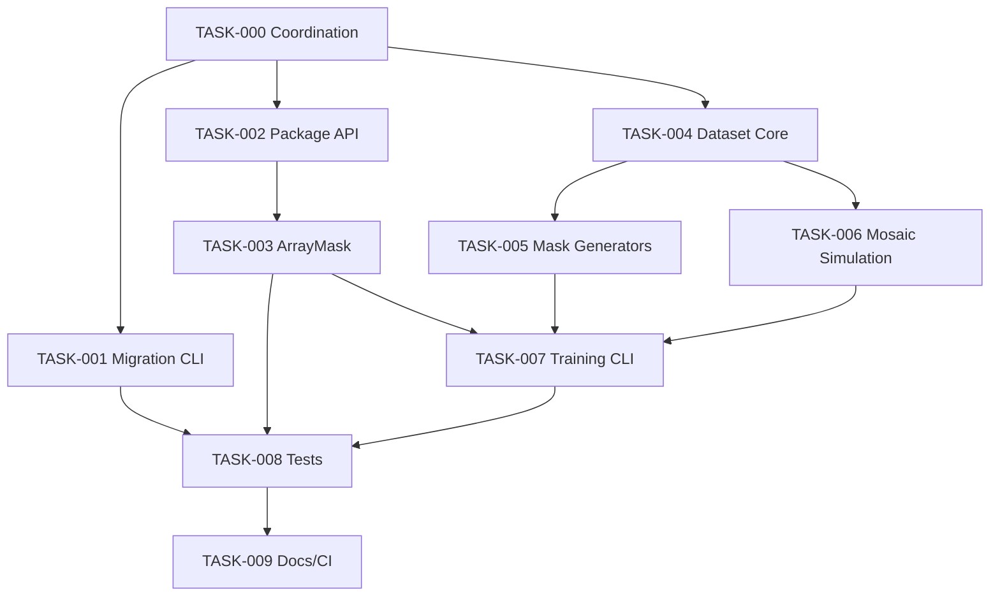

# TASK-000: Agent Coordination And Strict Rules

## Purpose

This file is the coordination contract for all Claude Code agents working on DeepCreamPy V2. Read this before starting any task file.

## Global Rules

1. Do not modify files outside your task ownership unless the task explicitly permits it.
2. Do not delete or rewrite user data, model checkpoints, downloaded models, input images, or output images.
3. Do not run destructive git commands such as `git reset --hard`, `git checkout --`, or mass deletes.
4. Do not install Python/TensorFlow packages into Windows global Python.
5. Use WSL Ubuntu 24.04 for TensorFlow work.
6. Use the WSL venv at `/home/usui/.venvs/deepcreampy-v2` if it exists.
7. If installing anything else, install inside WSL or a venv only.
8. Keep adult/explicit sample content out of tests, docs, issues, screenshots, and generated fixtures.
9. Generated fixtures must be synthetic shapes/colors/noise, not adult content.
10. Preserve existing user changes. If a file is dirty and not owned by your task, stop and report.
11. Add tests for every behavior change unless the task explicitly says docs-only.
12. Prefer small focused commits/patches per task.
13. Do not commit model artifacts. `models/*.keras`, `models/bar/*`, and `models/mosaic/*` are ignored for a reason.
14. Do not assume GPU availability. All smoke tests must run on CPU.
15. Long training jobs are forbidden in these tasks. Only smoke or tiny-overfit tests are allowed.

## Repository Facts

- Current repo root: `C:\Users\Usui\Desktop\Projects\DeepCreamPy-V2`
- WSL repo path: `/mnt/c/Users/Usui/Desktop/Projects/DeepCreamPy-V2`
- WSL venv: `/home/usui/.venvs/deepcreampy-v2`
- Downloaded TF1 checkpoints:
  - `models/bar/Train_775000`
  - `models/mosaic/Train_290000`
- Migrated Keras artifacts expected by the app:
  - `models/bar.keras`
  - `models/mosaic.keras`

## Verified ML Findings

- The downloaded checkpoints are TensorFlow 1 checkpoints.
- Each checkpoint has `232` variables.
- Each checkpoint has `33,751,549` scalar values.
- Main variable groups are `G_en`, `G_de`, `CB1`, and `disc_red`.
- Optimizer state exists as `Adam`, `Adam_1`, and `beta*_power`.
- Batch shape in the old graph is primarily `[8, 256, 256, 3]`.
- V2 Keras architecture matches the trainable checkpoint variable shapes.
- Basic migration, `.keras` reload, prediction, and one-batch training smoke have been verified.

## Parallel Execution Waves

## Safe Parallel Assignments

### Wave 1: Can Start Together

- Agent A: `TASK-001-CHECKPOINT-MIGRATION-CLI.MD`
- Agent B: `TASK-002-PUBLIC-PACKAGE-API.MD`
- Agent C: `TASK-004-DATASET-CORE.MD`

### Wave 2: Starts After Wave 1 Interfaces Exist

- Agent D: `TASK-003-ARRAY-MASK-SEMANTICS.MD`
- Agent E: `TASK-005-MASK-GENERATORS.MD`
- Agent F: `TASK-006-MOSAIC-SIMULATION.MD`

### Wave 3: Integration

- Agent G: `TASK-007-TRAINING-CLI.MD`
- Agent H: `TASK-008-TESTS-AND-SMOKE.MD`

### Wave 4: Polish

- Agent I: `TASK-009-DOCS-CI-RELEASE.MD`

## Conflict Rules

If two tasks need the same file:

1. Prefer creating new modules over editing shared modules.
2. If editing shared files is unavoidable, the later wave owns integration.
3. Never silently overwrite another agent's changes.
4. Mention any cross-task dependency in the final response.

## Required Final Response From Each Agent

Each agent must report:

- Files changed.
- Tests run.
- Tests skipped and why.
- Any task boundary violation needed.
- Remaining blockers.

