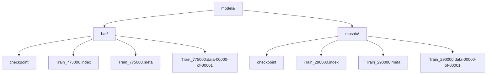
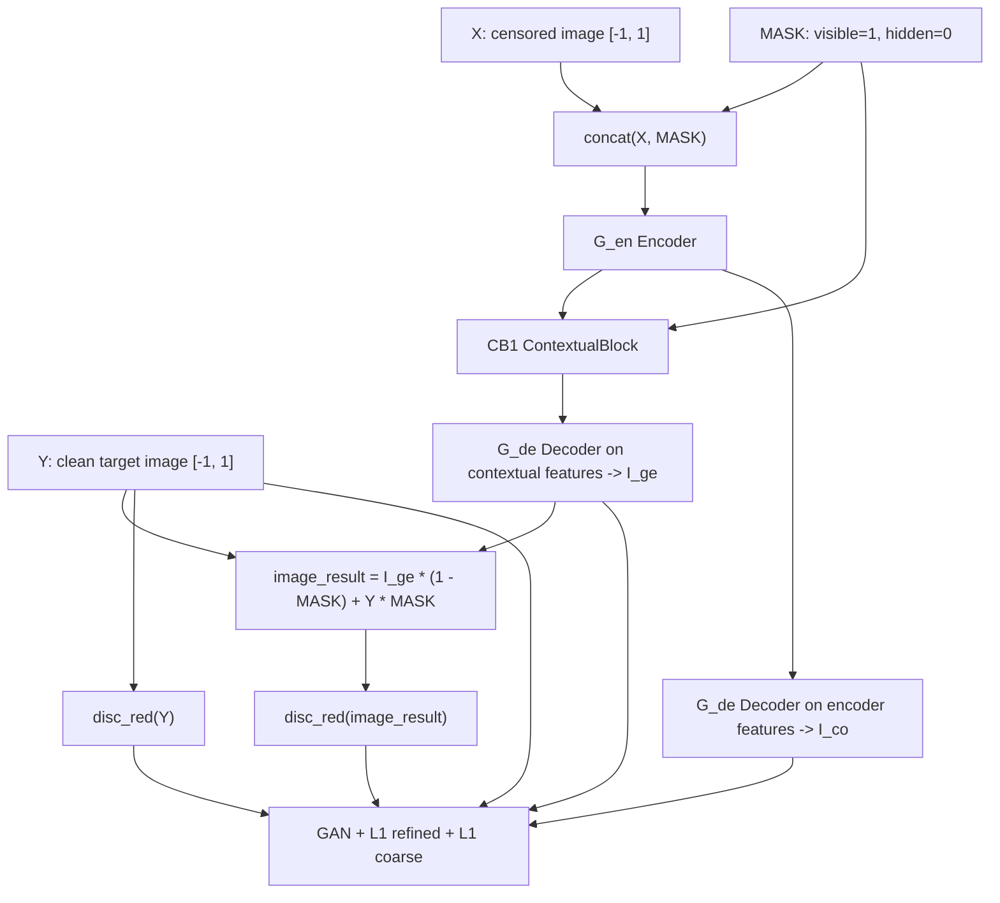
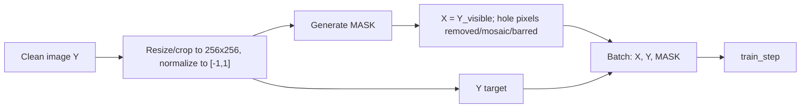
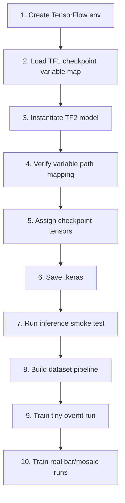

# Training Reverse Engineering Notes

This document explains what the downloaded model files are, what the current code already reverse-engineers, and what must be built to train new DeepCreamPy V2 models.

## Executive Summary

The downloaded `models/bar` and `models/mosaic` folders contain TensorFlow 1 checkpoints, not Keras `.keras` models.

```text
models/bar/Train_775000.*
models/mosaic/Train_290000.*
```

The current V2 server expects:

```text
models/bar.keras
models/mosaic.keras
```

So there are two separate jobs:

1. Convert/migrate the old TensorFlow 1 checkpoints into V2 Keras models.
2. Rebuild the training pipeline so new bar/mosaic models can be trained from image data.

The model architecture and loss are recoverable. The missing parts are dataset generation, robust training orchestration, checkpoint resume semantics, and export.

## Downloaded Model Inventory



| Model | Format | Step | Main Use |
|---|---|---:|---|
| `models/bar/Train_775000` | TensorFlow 1 checkpoint | 775000 | Bar/solid censor model |
| `models/mosaic/Train_290000` | TensorFlow 1 checkpoint | 290000 | Mosaic censor model |

The checkpoint variable names scanned from the files match the migration map in `lib-cream-py/src/model/model.py`:

- `G_en/*`: generator encoder
- `G_de/*`: generator decoder
- `CB1/*`: contextual attention/block layer
- `disc_red/*`: spectral-normalized red discriminator
- `Adam/*`, `Adam_1/*`, `beta*_power`: optimizer slot/state variables

## Current Model Anatomy

The model is a PEPSI-style inpainting GAN.



## Recovered Training Inputs

The old training graph used:

| Tensor | Shape | Meaning |
|---|---|---|
| `X` | `[batch_size, 256, 256, 3]` | masked/censored input image |
| `Y` | `[batch_size, 256, 256, 3]` | original clean target image |
| `MASK` | `[batch_size, 256, 256, 3]` | mask where `1` means known/visible and `0` means hidden/fill |
| `IT` | scalar float | current training iteration for the coarse-loss decay |

Important mask convention:

- In training, `MASK == 1` preserves `Y`.
- In training, `MASK == 0` is the hole to reconstruct.
- The current inference mask classes use `1 = selected/masked region`, so the pipeline must normalize conventions clearly before training/inference share code.

## Recovered Loss Function

The current TF2 port reproduces the old training losses:

```text
Loss_D = mean(relu(1 + D_fake)) + mean(relu(1 - D_real))
Loss_GAN = -mean(D_fake)
Loss_s_re = mean(abs(I_ge - Y))
Loss_hat = mean(abs(I_co - Y))
alpha = IT / 1000000
Loss_G = 0.1 * Loss_GAN + 10 * Loss_s_re + 5 * (1 - alpha) * Loss_hat
```

Optimizers:

| Optimizer | Learning Rate | beta_1 | beta_2 | Variables |
|---|---:|---:|---:|---|
| Discriminator Adam | `0.0004` | `0.5` | `0.9` | `disc_red/*` |
| Generator Adam | `0.0001` | `0.5` | `0.9` | `G_en/*`, `G_de/*`, `CB1/*` |

The old training target was `Max_iter = 1000000`.

## What The Current V2 Code Already Has

`lib-cream-py/src/model/model.py` already has:

- `InpaintModel`
- `InpaintNN`
- `migrate_weights()`
- `train()`
- `predict_image()`
- generator architecture
- red discriminator
- checkpoint creation
- rough TF2 custom training loop

However, `train()` is not production-ready yet.

## Critical Gaps To Fix

### 1. Installable ML Environment

The local bundled Python inspected here does not include TensorFlow or Keras. To actually inspect checkpoints with `tf.compat.v1.train.NewCheckpointReader`, migrate weights, or train, the project needs a real ML environment.

Recommended environment:

```bash
python -m venv .venv
.venv\Scripts\activate
pip install --upgrade pip
pip install tensorflow keras numpy pillow
```

Then verify:

```bash
python -c "import tensorflow as tf, keras; print(tf.__version__, keras.__version__)"
```

### 2. Convert Downloaded Checkpoints To `.keras`

The app expects `.keras` models, but the downloaded files are old checkpoints.

Target commands to add:

```bash
python -m lib_cream_py.tools.migrate_checkpoint ^
  --checkpoint models/bar/Train_775000 ^
  --out models/bar.keras

python -m lib_cream_py.tools.migrate_checkpoint ^
  --checkpoint models/mosaic/Train_290000 ^
  --out models/mosaic.keras
```

Current blocker:

- `InpaintNN(..., create_model=True)` does not currently initialize `self.model` before `migrate_weights()` expects it.
- `lib_cream_py.train()` accidentally creates `./temp/mosaic.keras` then calls `migrate_weights()` with the default bar checkpoint path.
- Keras custom layers need reliable serialization registration before `.keras` export is trustworthy.

### 3. Dataset Generation

Training needs clean images. Censored inputs are generated synthetically.



Minimum dataset module:

```text
lib-cream-py/src/data/
  images.py
  masks.py
  mosaic.py
  pipeline.py
  debug_export.py
```

Needed generators:

- Free-form irregular masks equivalent to the old `ff_mask_batch`.
- Square masks for validation.
- Bar censor masks for bar model training.
- Mosaic censor simulation for mosaic model training.
- Optional detector/ndarray mask ingestion later.

### 4. Mask Convention Cleanup

Training and inference must agree on mask semantics.

Recommended internal standard:

```text
hole_mask: bool ndarray, True = area to reconstruct
known_mask: float tensor, 1 = visible/known, 0 = hidden/hole
```

Then training conversion is:

```python
known_mask = 1.0 - hole_mask.astype(np.float32)
known_mask = np.repeat(known_mask[..., None], 3, axis=-1)
```

### 5. Proper `IT` / Global Step

Current code:

```python
IT = 0
alpha = IT / 1000000
```

Needed:

```python
global_step = tf.Variable(0, trainable=False, dtype=tf.int64)
alpha = tf.cast(global_step, tf.float32) / max_iterations
```

`global_step` must be saved/restored in checkpoints.

### 6. Optimizer State

The old checkpoints contain Adam slot variables. For new TF2 training:

- Build model variables before restoring.
- Build optimizer variables before restoring.
- Checkpoint generator, discriminator, both optimizers, and global step.
- Test save/restore on a tiny dataset.

### 7. Training Command

Target command:

```bash
python -m lib_cream_py.train ^
  --kind bar ^
  --image-dir ./data/clean ^
  --work-dir ./runs/bar-v1 ^
  --export models/bar.keras ^
  --batch-size 8 ^
  --max-steps 1000000 ^
  --save-every 10000
```

Target outputs:

```text
runs/bar-v1/
  config.json
  checkpoints/
  samples/
  metrics/
  export/bar.keras
```

## Practical Reverse Engineering Plan



## First Concrete Implementation Tasks

1. Add `tools/inspect_checkpoint.py` using TensorFlow's checkpoint reader.
2. Fix `InpaintNN(create_model=True)` so it actually creates and builds `self.model`.
3. Add `tools/migrate_checkpoint.py` for bar and mosaic checkpoints.
4. Add a fake/tiny image dataset generator.
5. Add `ArrayMask`/mask convention helpers.
6. Add `data/masks.py` with free-form mask generation.
7. Add `train.py` CLI with checkpointing and sample image export.
8. Add tests for model build, checkpoint save/restore, and one train step.

## Sanity Check For Training

A real training implementation should pass these milestones before any long run:

- Can create one `(X, Y, MASK)` batch from clean images.
- Can run one generator forward pass.
- Can run one discriminator forward pass.
- Can compute finite `Loss_D` and `Loss_G`.
- Can apply one train step without NaNs.
- Can save and restore checkpoint.
- Can overfit 4 to 16 tiny samples.
- Can export `.keras`.
- Exported model can run the existing inference pipeline.

## Bottom Line

Training is feasible, but the current repo is only halfway there.

The old model/training recipe is recoverable from:

- the downloaded TF1 checkpoints,
- the existing migration map,
- the current TF2 model port,
- and the original PEPSI/DeepCreamPy training structure.

The next best engineering move is not to start a full training run. It is to first make checkpoint migration and a one-step/tiny-overfit training loop work. Once that is green, scaling to real bar and mosaic model training becomes an infrastructure problem rather than a mystery.

